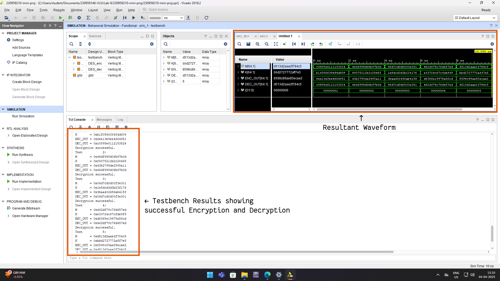

---
title: "FPGA SYSTEM DESIGN LAB — MINI PROJECT REPORT"
author: |
  \textbf{Lakshit Verma}  \texttt{\small(230959210)}
  \textbf{Priyansh Sarkar}  \texttt{\small(230959200)}
  \textbf{Ayush Gupta}  \texttt{\small(230959206)}
date: "April 2025"
geometry: margin=3cm
...

\begin{center}
\textit{\Large DES Cryptosystem in Verilog on FPGA}
\end{center}

# INTRODUCTION

## 1. Background Information

The Data Encryption Standard (DES) is a symmetric-key algorithm widely used for data security. It operates on 64-bit data blocks using a 56-bit key and follows 16 rounds of Feistel network-based encryption. With the rise of FPGA technology, hardware implementations of cryptographic algorithms like DES offer speed and efficiency advantages over software-based encryption.

## 2. Objectives and Scope

**Objectives:**

- Implement DES encryption/decryption using Verilog on an FPGA.
- Optimize the design for speed and resource efficiency.
- Ensure correctness by comparing results with known DES outputs.

**Scope:**

- Both decryption and encryption are implemented.
- The design includes key scheduling and Feistel function implementation.
- The project is tested on software only; hardware testing on an actual FPGA board is not included.

## 3. Overview of the Verilog Design

The design follows the standard DES encryption process:

- **Initial Permutation (`IP`)**: Rearranges the 64-bit plaintext input.

- **16 Feistel Rounds**:
  - Expands the right half from 32 to 48 bits (Expansion Permutation E).
  - XORs the expanded right half with a round key.
  - Uses S-Boxes to substitute 6-bit values into 4-bit outputs.
  - Applies a final permutation (P-Box) on the substituted bits.
  - Swaps halves and repeats for 16 rounds.

- **Final Permutation (`IP_inv`)**: Restores the order to produce the ciphertext.

### Why Verilog?

1. **Parallel processing capability** of FPGA, improving encryption speed.
2. **Hardware-level security** since keys are not exposed in software memory.
3. **Customizability**, allowing for optimized DES implementations.

## 4. Problem Definition & Motivation

1. **Software-based DES implementations** are slower compared to hardware due to sequential processing.
2. **FPGAs offer parallel execution**, making them ideal for cryptographic tasks.
3. **Applications include** secure communication, embedded security, and fast encryption in resource-constrained environments.

# 2. SYSTEM DESIGN AND ARCHITECTURE

## High-level design overview (block diagram of the system)

{width=35%}

{width=35%}

## Description of the Overall System Architecture

The system is composed of three main components: key scheduling, encryption, and control modules. Each of these plays a crucial role in ensuring secure and efficient encryption. The architecture is designed with a focus on parallelism and pipelining, which allows for high-speed data processing and optimized resource utilization.

The encryption process begins when the system receives a 64-bit plaintext message and a 64-bit secret key as inputs. The key scheduling module processes the secret key to generate 16 unique subkeys, each 48 bits long. These subkeys are then sequentially applied during encryption rounds to transform the plaintext into ciphertext. The encryption module follows the Feistel structure, executing multiple rounds of expansion, permutation, substitution, and XOR operations to ensure a high level of security.

The control unit is responsible for managing the overall flow of data and synchronization between the modules. It ensures that subkeys are used in the correct order, encryption rounds execute in sequence, and final ciphertext output is correctly generated. By coordinating these operations, the control module optimizes performance and maintains accuracy in the encryption process.

## Key Modules and Their Interconnections

**`E` Module**

1. **Function:**
   - Performs the Expansion Permutation (E).
   - Expands a 32-bit input to 48-bit for XOR with subkeys.

2. **Inputs and Outputs:**
   - **Input:** `in` (32-bit) – Right half of data before Feistel function.
   - **Output:** `out` (48-bit) – Expanded data.

**`P` Module**

1. **Function:**
   - Applies the Permutation (P-box) on the output of S-boxes.

2. **Inputs and Outputs:**
   - **Input:** `in` (32-bit) – Data from S-box outputs.
   - **Output:** `out` (32-bit) – Permuted data.

**S-Box Modules (`S1` to `S8`)**

1. **Function:**
   - Each S-box (`S1` to `S8`) takes a 6-bit input and returns a 4-bit output.

2. **Inputs and Outputs:**
   - **Input:** `in` (6-bit) – XOR result of expanded right half and subkey.
   - **Output:** `out` (4-bit) – Substituted value.

**`IP` and `IP_inv` Modules**

1. **Function:**
   - `IP`: Performs the Initial Permutation (IP).
   - `IP_inv`: Performs the Inverse Initial Permutation ($IP^{-1}$).

2. **Inputs and Outputs:**
   - **Input:** `in` (64-bit) – Message block.
   - **Output:** `out` (64-bit) – Permuted message.

**`PC1` and `PC2` Modules**

1. **Function:**
   - `PC1`: Generates a 56-bit key from a 64-bit key by applying a fixed permutation.
   - `PC2`: Generates a 48-bit subkey from the 56-bit key halves.

2. **Inputs and Outputs:**
   - **PC1 Input:** `in` (64-bit) – Original key.
   - **PC1 Output:** `out` (56-bit) – Permuted key.
   - **PC2 Input:** `in` (56-bit) – Shifted key halves.
   - **PC2 Output:** `out` (48-bit) – Round subkey.

**`f` Module (Feistel Function)**

1. **Function:**
   - Implements the Feistel function.
   - Expands the right half, XORs with the round key, applies S-boxes, and permutes the result.

2. **Inputs and Outputs:**
   - **Inputs:** `R` (32-bit) – Right half of data, `K` (48-bit) – Round key.
   - **Output:** `OUT` (32-bit) – Processed data.

3. **Subcomponents and Functions:**
   - `E` expands `R` to 48 bits.
   - XORs with `K`.
   - S-boxes substitute values.
   - `P` applies a final permutation.

**`KS` Module (Key Scheduling)**

1. **Function:**
   - Generates 16 round subkeys.

2. **Inputs and Outputs:**
   - **Input:** `key` (64-bit) – Original encryption key.
   - **Outputs:** `k1` to `k16` (48-bit each) – 16 round keys.

3. **Subcomponents and Functions:**
   - `PC1` generates `C0` and `D0`.
   - Left shifts are applied per round.
   - `PC2` generates subkeys.

**`DES_enc` and `DES_dec` Module**

1. **Function:**
   - Implement the DES encryption process.
   - Use the 16 rounds of Feistel structure.

2. **Inputs and Outputs:**
   - For `DES_enc`:
   a. **Inputs:** `in` (64-bit) – Plaintext, `key` (64-bit) – Encryption key.
   b. **Output:** `out` (64-bit) – Ciphertext.
   - For `DES_dec`:
   c. **Inputs:** `in` (64-bit) – Ciphertext, `key` (64-bit) – Decryption key.
   d. **Output:** `out` (64-bit) – Plaintext.

3. **Encryption Process:**
   - `IP` permutes input.
   - Splits into `L0` and `R0`.
   - Performs 16 Feistel rounds:
     - `R[i] = L[i-1]` $\oplus$ ` f(R[i-1], K[i])`
     - `L[i] = R[i-1]`
   - `IP_inv` permutes the final swapped halves to produce `out`.

4. **Decryption Process:**
   - Similar to encryption but uses the subkeys in reverse order.
   - The same `IP` and `IP_inv` are applied.

**Interconnection Between Modules**

1. **`KS` → `DES`**
   - The `KS` module generates 16 subkeys (`k1` to `k16`).
   - These subkeys are used in `DES` for each encryption round.

2. **`DES` → Output (`out`)**
   - The `DES` module encrypts the input message and outputs the final ciphertext.

## Explanation of Design Choices Made for the Architecture

1. **Pipeline Optimization:** The design leverages pipelining to improve throughput, allowing multiple encryption operations to be processed simultaneously.

2. **Parallel Processing:** Parallel execution of subkey generation and encryption rounds speeds up computation.

3. **Resource Utilization:** The design minimizes logic and memory footprint to fit within FPGA constraints.

4. **Modular Design:** Each module is designed to be reusable and easily testable, promoting code maintainability and clarity.

# 3. Source Code

The source code and testbench are both given below:

```
module f(input [32:1] R, input [48:1] K, output [32:1] OUT);
    wire [48:1] R_E;
    E E_inst(R, R_E);

    wire [48:1] T = R_E ^ K;

    wire [6:1] S1_in, S2_in, S3_in, S4_in, S5_in, S6_in, S7_in, S8_in;
    assign {S1_in, S2_in, S3_in, S4_in, S5_in, S6_in, S7_in, S8_in} = T;

    wire [4:1] S1_out, S2_out, S3_out, S4_out, S5_out, S6_out, S7_out, S8_out;
    S1 S1_inst(S1_in, S1_out);
    S2 S2_inst(S2_in, S2_out);
    S3 S3_inst(S3_in, S3_out);
    S4 S4_inst(S4_in, S4_out);
    S5 S5_inst(S5_in, S5_out);
    S6 S6_inst(S6_in, S6_out);
    S7 S7_inst(S7_in, S7_out);
    S8 S8_inst(S8_in, S8_out);

    wire [32:1] S_out = {S1_out, S2_out, S3_out, S4_out, S5_out, S6_out, S7_out, S8_out};
    P P_inst(S_out, OUT);
endmodule


module KS_left_shift(input [5:1] level, input [28:1] in, output [28:1] out);
    assign out = (level == 1 || level == 2 || level == 9 || level == 16) ?
                                {in[27:1], in[28]} : {in[26:1], in[28:27]};
endmodule

module KS(input [64:1] key, output [48:1] k1, k2, k3, k4, k5, k6, k7, k8,
                                          k9, k10, k11, k12, k13, k14, k15, k16);
    wire [56:1] key_pc1;
    PC1 pc1_inst(key, key_pc1);

    wire [28:1] c [0:16];
    wire [28:1] d [0:16];
    wire [48:1] k [1:16];

    assign {c[0], d[0]} = key_pc1;

    genvar i;
    generate
        for (i = 1; i <= 16; i = i + 1) begin : blk
            wire [5:1] j = i;
            KS_left_shift KS_ls_inst1(j, c[i - 1], c[i]);
            KS_left_shift KS_ls_inst2(j, d[i - 1], d[i]);
            PC2 pc2_inst({c[i], d[i]}, k[i]);
        end
    endgenerate

    assign k1 = k[1];
    assign k2 = k[2];
    assign k3 = k[3];
    assign k4 = k[4];
    assign k5 = k[5];
    assign k6 = k[6];
    assign k7 = k[7];
    assign k8 = k[8];
    assign k9 = k[9];
    assign k10 = k[10];
    assign k11 = k[11];
    assign k12 = k[12];
    assign k13 = k[13];
    assign k14 = k[14];
    assign k15 = k[15];
    assign k16 = k[16];
endmodule


module DES_enc(input [64:1] in, input [64:1] key, output [64:1] out);
    wire [64:1] in_ip;
    IP ip_inst(in, in_ip);

    wire [32:1] l [0:16];
    wire [32:1] r [0:16];
    wire [32:1] f_val [1:16];
    assign {l[0], r[0]} = in_ip;

    wire [48:1] k [1:16];
    KS ks_inst(key, k[1], k[2], k[3], k[4], k[5], k[6], k[7], k[8],
                    k[9], k[10], k[11], k[12], k[13], k[14], k[15], k[16]);

    genvar i;
    generate
        for (i = 1; i <= 16; i = i + 1) begin : blk
            assign l[i] = r[i - 1];
            f f_inst(r[i - 1], k[i], f_val[i]);
            assign r[i] = l[i - 1] ^ f_val[i];
        end
    endgenerate

    IP_inv ip_inv_inst({r[16], l[16]}, out);
endmodule


module DES_dec(input [64:1] in, input [64:1] key, output [64:1] out);
    wire [64:1] in_ip;
    IP ip_inst(in, in_ip);

    wire [32:1] l [0:16];
    wire [32:1] r [0:16];
    wire [32:1] f_val [1:16];
    assign {l[0], r[0]} = in_ip;

    wire [48:1] k [1:16];
    KS ks_inst(key, k[16], k[15], k[14], k[13], k[12], k[11], k[10], k[9], k[8],
                           k[7], k[6], k[5], k[4], k[3], k[2], k[1]); // Reverse order

    genvar i;
    generate
        for (i = 1; i <= 16; i = i + 1) begin : blk
            assign l[i] = r[i - 1];
            f f_inst(r[i - 1], k[i], f_val[i]);
            assign r[i] = l[i - 1] ^ f_val[i];
        end
    endgenerate

    IP_inv ip_inv_inst({r[16], l[16]}, out);
endmodule
module E(input [1:32] in, output [1:48] out);
    assign out[1] = in[32];
    assign out[2] = in[1];
    assign out[3] = in[2];
    ...
    // continues till 48
endmodule

module P(input [1:32] in, output [1:32] out);
    assign out[1] = in[16];
    assign out[2] = in[7];
    assign out[3] = in[20];
    ...
    // continues till 32
endmodule

module S1(input [6:1] in, output reg [4:1] out);
    always @* case (in)
        0 : out = 14;
        1 : out = 0;
        2 : out = 4;
        3 : out = 15;
        4 : out = 13;
        ...
        // continues till 63
endmodule

// modules S2 through S8 are similar S-boxes. Not shown for brevity's sake.

module IP(input [1:64] in, output [1:64] out);
    assign out[1] = in[58];
    assign out[2] = in[50];
    assign out[3] = in[42];
    ...
    // continues till out[64]
endmodule

module IP_inv(input [1:64] in, output [1:64] out);
    assign out[1] = in[40];
    assign out[2] = in[8];
    assign out[3] = in[48];
    ...
    // continues till out[64]
endmodule

module PC1(input [1:64] in, output [1:56] out);
    assign out[1] = in[57];
    assign out[2] = in[49];
    assign out[3] = in[41];
    ...
    // continues till out[56]
endmodule

module PC2(input [1:56] in, output [1:48] out);
    assign out[1] = in[14];
    assign out[2] = in[17];
    assign out[3] = in[11];
    ...
    // continues till out[56]
endmodule
```

# 4. RESULTS




\pagebreak

# 5. CONCLUSION

This project successfully implemented the Data Encryption Standard (DES) algorithm using Verilog, achieving encryption through a structured Feistel network. The design incorporates key expansion, generating 16 subkeys from a 64-bit key using proper permutations (`PC1`, `PC2`) and shifting operations. The encryption process follows 16 iterative rounds, where each round applies expansion (`E`), S-Box substitution, and P-Box permutation to ensure diffusion and confusion. The `IP` and `IP_inv` modules are used for initial and final permutations respectively, to enchance security further.

By structuring the implementation into modular components (`ProcessKey` and `Encrypt`), the design remains efficient, reusable, and adaptable for hardware-based cryptographic applications such as FPGA and ASIC systems.

Beyond encryption, this project gave us an in-depth understanding of both block cipher principles, including permutation, substitution, key-dependent transformations and a greater understanding of Verilog in general. Additionally, this project can serve as a foundation for further cryptographic advancements, such as extending DES to 3DES or transitioning to AES for enhanced security.

# 6. REFERENCES

1. **FIPS PUB 46-3, "Data Encryption Standard (DES),"** National Institute of Standards and Technology (NIST), 1999. [Online]. Available: [https://csrc.nist.gov/publications/detail/fips/46/3/final](https://csrc.nist.gov/publications/detail/fips/46/3/final)

2. **Data Encryption Standard (DES),** Neso Academy - YouTube Playlist. [Online]. Available: [https://www.youtube.com/playlist?list=PLBlnK6fEyqRiOCCDSdi6Ok_8PU2f_nkuf](https://www.youtube.com/playlist?list=PLBlnK6fEyqRiOCCDSdi6Ok_8PU2f_nkuf)

